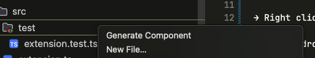

# VS Code Files Generator Extension

A powerful Visual Studio Code extension that helps developers generate React components efficiently with pre-defined Next.js file structures. This extension prompts the user for a component name, validates it, and creates a folder with the necessary files, following best practices for Next.js development.

## Features



- **Component Scaffolding**: Quickly generate a new component folder with:
  - `[ComponentName].tsx`: The main component file.
  - `[ComponentName].module.scss`: A scoped stylesheet for the component.
  - `index.ts`: A default export file for clean imports.
- **Naming Validation**: Ensures the component folder name:
  - Starts with a letter.
  - Contains only alphanumeric characters.
  - Does not start with a number or include special characters.
- **Ease of Use**: Integrates seamlessly into VS Code's context menu. Right-click on a folder and select "Generate Component" to start.

## Installation

1. Clone this repository or download the source code.
2. Open the project in VS Code.
3. Run `npm install` to install the required dependencies.
4. Open the **Extensions View** (`Ctrl+Shift+X` or `Cmd+Shift+X` on Mac) in VS Code.
5. Click the **Install from VSIX** option and select the `.vsix` file from your local directory.

## Usage

1. Right-click on any folder in the **Explorer** pane.
2. Select **Generate Component** from the context menu.
3. Enter a valid component folder name when prompted.
4. The extension will create a new folder with the specified name and the following files:
   ```
   ComponentName/
       ComponentName.tsx
       ComponentName.module.scss
       index.ts
   ```
5. Start developing your component immediately!

## Folder Name Validation

The extension enforces the following rules for folder names:
- Must start with a letter (A-Z or a-z).
- Can only contain alphanumeric characters (A-Z, a-z, 0-9).
- Special characters and names starting with numbers are not allowed.

Example of valid folder names:
- `MyComponent`
- `myComponent`

Invalid folder names:
- `123Component`
- `Component#Name`

## File Content Structure

- **`[ComponentName].tsx`**:
  ```tsx
  import React from 'react';
  import styles from './[ComponentName].module.scss';

  const [ComponentName] = () => {
      return (
          <div className={styles.root}>
              {/* Your content here */}
          </div>
      );
  };

  export default [ComponentName];
  ```
- **`[ComponentName].module.scss`**:
  ```scss
  .root {
      /* Add your styles here */
  }
  ```
- **`index.ts`**:
  ```typescript
  export { ComponentName as default } from './index';
  ```

## Contributing

Contributions are welcome! Follow these steps to contribute:
1. Fork this repository.
2. Create a new branch (`git checkout -b feature-branch`).
3. Make your changes and commit them (`git commit -m "Add feature"`).
4. Push to the branch (`git push origin feature-branch`).
5. Create a pull request.

## License

This project is licensed under the [MIT License](https://github.com/pratikkumar399/filesgenerator/blob/master/LICENSE.md).

## Acknowledgements

- Inspired by the need for efficient React component generation.
- Built with ❤️ for the open-source community.

